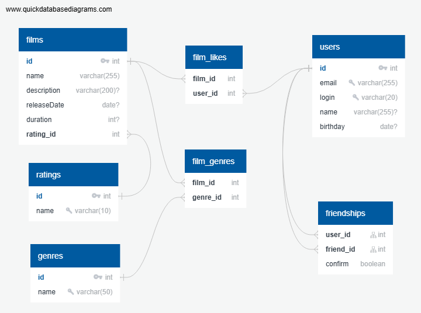

# java-filmorate
Template repository for Filmorate project.

## Диаграмма БД



## Описание таблиц в диаграмме.

- **films** - таблица с фильмами
	- id - идентификатор. Автоматическая генерация.
	- name - наименование. Обязательное. Ограничение в 255 символов. Текущий рекорд - 171 символ в переводе, 178 в оригинале.
	- description - описание фильмами. Необязательное.
	- releaseDate - дата выпуска. Необязательное.
	- duration - время в минутах. Необязательное.
	- rating_id - рейтинг. Ссылка на таблицу Rating, к полю id.

- **ratings** - таблица [рейтингов Ассоциации кинокомпаний MPA](https://en.wikipedia.org/wiki/Motion_Picture_Association_film_rating_system)
	- id - идентификатор. Автоматическая генерация.
	- name - наименование. Ограничение в 10 символов. Описание рейтингов можно взять.

- **genres** - таблица жанров фильмов
	- id - идентификатор. Автомтатическая генерация.
	- name - наименование. Ограничение в 50 символов.

- **film_genres** - таблица	жанров фильмов. Один фильма может быть отнесён к нескольким жанрам.
	- film_id - фильм. Ссылка на таблицу Film, поле id.
	- genre_id - жанр. Ссылка на таблицу Genre, поле id.

- **users** - пользователь
	- id - идентификатор. Автоматическая генерация.
	- email - адрес элекстронной почты. Уникальное обязательное поле. Ограничение в 255 символов.
	- login - логин. Уникальное обязательное поле. Ограничение в 20 символов.
	- name - имя пользователя. Обязательное поле. Ограничение в 255 символов.
	- birthday - день рождения. Необязательное поле

- **film_likes** - таблица понравивишихся фильмов пользователям. Один фильм может понравится многим пользователям, одному пользователю может понравится множество фильмов.
	- film_id - фильм. Ссылка на таблицу Film, поле id.
	- user_id - пользователь. Ссылка на таблицу User, поле id.

- **friendships** - таблица друзей среди пользователей. Один пользователь может дружить со множеством других пользователей. Дружба не дублируется, т.е. при наличии записи друг1- друг2, запись друг2-друг1 не должна появляться.
	- user_id - пользователь - инициатор дружбы. Ссылка на таблицу User, поле id.
	- friend_id - пользователь - друг. Ссылка на таблицу User, поле id.
	- confirm - подтверждение дружбы. boolean.


## Создание БД в PostgreSQL

[Предварительный SQL с набором CREATE TABLE для таблиц из диаграммы](QuickDBD-Filmorate-After-Rename.sql)

## Примеры некоторых запросов

### список фильмов наименований фильмов с рейтингом PG
```
SELECT f.name,
       r.name
FROM fllms AS f
JOIN ratings AS r ON f.rating_id = r.id
WHERE r.name = 'PG';
```

### Первые 10 фильмов с максимальным рейтингом

```
SELECT f.name AS film_name,
       count(fl.user_id) AS COUNT
FROM film_likes AS fl
JOIN films AS f ON f.id = fl.film_id
GROUP BY fl.film_id
ORDER BY COUNT DESC
LIMIT 10;
```

### Список подтвержденных друзей пользователя с id = 128
```
SELECT u.name AS name,
       u.email AS email
FROM friendships AS fs
JOIN users AS u ON u.id = fs.user_id
WHERE fs.user_id = 128
  AND fs.confirm = 'true'
UNION
SELECT u.name AS name,
       u.email AS email
FROM friendships AS fs
JOIN users AS u ON u.id = fs.friend_id
WHERE fs.friend_id = 128
  AND fs.confirm = 'true'
ORDER BY name
```

### Список общих подтвержденных друзей пользователя с id = 100 и пользователя с id = 200
```
SELECT DISTINCT id,
                name,
                email
FROM
  (SELECT u.id AS id,
          u.name AS name,
          u.email AS email
   FROM friendships AS fs
   JOIN users AS u ON u.id = fs.user_id
   WHERE (fs.user_id = 100
          OR fs.user_id = 200)
     AND fs.confirm = 'true'
   UNION SELECT u.id AS id,
                u.name AS name,
                u.email AS email
   FROM friendships AS fs
   JOIN users AS u ON u.id = fs.friend_id
   WHERE (fs.friend_id = 100
          OR fs.friend_id = 100)
     AND fs.confirm = 'true')
ORDER BY name
```
